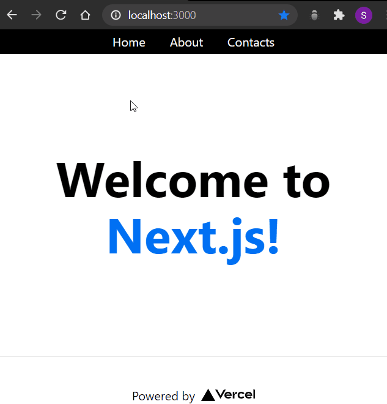

# Persistent Layout on NextJS

An example on how a basic persistent layout can be integrated in a NextJS startup project.



# Usage

You can [Use This Template](https://github.com/simo54/nextjs_persistent_layout/generate) ([here](https://docs.github.com/en/github/creating-cloning-and-archiving-repositories/creating-a-repository-from-a-template#about-repository-templates) an info about this feature) or download this repo using

```
git clone https://github.com/simo54/nextjs_persistent_layout.git
```

Once locally, run first

```
npm run build
```

and then

```
npm run dev
```

## Navbar Credit

[benweitzel](https://gist.github.com/benweitzel/8621181)
